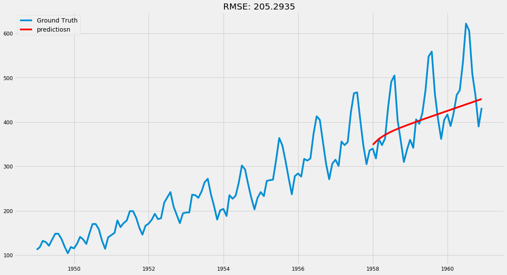

### 来源：https://github.com/advaitsave/Introduction-to-Time-Series-forecasting-Python

写在前面，随着时间更新，有些包的名称或者api使用有些许改变，需要自己试试。
此外，很多地方有许多不同参数，如指数滑动平均有好几种形式，本文中仅使用了halflife，又如序列成分分解的时候，有两种模型，这里也是只用了其中一种，实际应用的时候最好看看不熟悉的api的用法，多试试找出效果最好的。


[时间序列分析](https://blog.csdn.net/pipisorry/article/details/62053938)

#### 时间序列：
- 时间序列指在一组连续时间上测得的数据点；
- 其在数学上的定义是一组向量 x(t), t=0,1,2,3,..., 其中t表示数据所在时间点;
- x(t)是是一组按时间顺序（测得）排列的随机变量；
- 包含单个变量的时间序列称为单变量时间序列，而包含多个变量的时间序列则称为多变量。

时间序列在很多方面多有涉及到，如天气预报，每天每个小时的气温，股票走势等等，在商业方面有诸多应用：
- 销售预测，零售产品销量预测；
- 需求预测，用于定价，库存和劳动力管理；
- 交通预测，运输和路线优化，道路设施设计；
- 收入预测，预算和目标设定。

下面我们将通过一个航班数据来说明如何使用已有工具来进行时间序列数据预测。

## 导入相关包


```python
import warnings
warnings.filterwarnings('ignore')

import itertools
import numpy as np
import matplotlib.pyplot as plt
plt.style.use('fivethirtyeight')

import pandas as pd
pd.set_option('display.expand_frame_repr', False)
pd.set_option('display.max_columns', 500)
pd.set_option('display.width', 1000)

import statsmodels.api as sm
from statsmodels.graphics.tsaplots import plot_acf
from statsmodels.graphics.tsaplots import plot_pacf
from statsmodels.tsa.stattools import adfuller
from statsmodels.tsa.seasonal import seasonal_decompose
from statsmodels.tsa.ar_model import AR
from statsmodels.tsa.arima_model import ARMA, ARIMA
from pmdarima.arima import auto_arima
from statsmodels.tsa.statespace.sarimax import SARIMAX
from fbprophet import Prophet

from math import sqrt

import matplotlib
matplotlib.rcParams['axes.labelsize'] = 14
matplotlib.rcParams['xtick.labelsize'] = 12
matplotlib.rcParams['ytick.labelsize'] = 12
matplotlib.rcParams['text.color'] = 'k'

import seaborn as sns

from random import random

from sklearn.metrics import mean_squared_error, r2_score, \
    mean_absolute_error, median_absolute_error, mean_squared_log_error

```

## 载入数据

数据集：不同年月份国际航空客运量统计（单位：千）。

先简单查看一下数据统计信息（均值、方差、极值、数据量等），查看数据中是否有缺失值，并对缺失值进行处理。


```python
df = pd.read_csv('international-airline-passengers.csv',
                header=None)
df.columns = ['year', 'passengers']
df.head()
```


<div>
<style scoped>
    .dataframe tbody tr th:only-of-type {
        vertical-align: middle;
    }

    .dataframe tbody tr th {
        vertical-align: top;
    }

    .dataframe thead th {
        text-align: right;
    }
</style>
<table border="1" class="dataframe">
  <thead>
    <tr style="text-align: right;">
      <th></th>
      <th>year</th>
      <th>passengers</th>
    </tr>
  </thead>
  <tbody>
    <tr>
      <td>0</td>
      <td>1949-01</td>
      <td>112</td>
    </tr>
    <tr>
      <td>1</td>
      <td>1949-02</td>
      <td>118</td>
    </tr>
    <tr>
      <td>2</td>
      <td>1949-03</td>
      <td>132</td>
    </tr>
    <tr>
      <td>3</td>
      <td>1949-04</td>
      <td>129</td>
    </tr>
    <tr>
      <td>4</td>
      <td>1949-05</td>
      <td>121</td>
    </tr>
  </tbody>
</table>
</div>


```python
df.describe()
```


<div>
<style scoped>
    .dataframe tbody tr th:only-of-type {
        vertical-align: middle;
    }

    .dataframe tbody tr th {
        vertical-align: top;
    }

    .dataframe thead th {
        text-align: right;
    }
</style>
<table border="1" class="dataframe">
  <thead>
    <tr style="text-align: right;">
      <th></th>
      <th>passengers</th>
    </tr>
  </thead>
  <tbody>
    <tr>
      <td>count</td>
      <td>144.000000</td>
    </tr>
    <tr>
      <td>mean</td>
      <td>280.298611</td>
    </tr>
    <tr>
      <td>std</td>
      <td>119.966317</td>
    </tr>
    <tr>
      <td>min</td>
      <td>104.000000</td>
    </tr>
    <tr>
      <td>25%</td>
      <td>180.000000</td>
    </tr>
    <tr>
      <td>50%</td>
      <td>265.500000</td>
    </tr>
    <tr>
      <td>75%</td>
      <td>360.500000</td>
    </tr>
    <tr>
      <td>max</td>
      <td>622.000000</td>
    </tr>
  </tbody>
</table>
</div>


```python
df.describe(include='O')
```


<div>
<style scoped>
    .dataframe tbody tr th:only-of-type {
        vertical-align: middle;
    }

    .dataframe tbody tr th {
        vertical-align: top;
    }

    .dataframe thead th {
        text-align: right;
    }
</style>
<table border="1" class="dataframe">
  <thead>
    <tr style="text-align: right;">
      <th></th>
      <th>year</th>
    </tr>
  </thead>
  <tbody>
    <tr>
      <td>count</td>
      <td>144</td>
    </tr>
    <tr>
      <td>unique</td>
      <td>144</td>
    </tr>
    <tr>
      <td>top</td>
      <td>1950-07</td>
    </tr>
    <tr>
      <td>freq</td>
      <td>1</td>
    </tr>
  </tbody>
</table>
</div>


```python
print(f'Time period start: {df.year.min()}\nTime period end: {df.year.max()}')

```

    Time period start: 1949-01
    Time period end: 1960-12


```python
df.shape
```


    (144, 2)


## 数据处理和可视化
通过简单的初步处理以及可视化可以帮助我们有效快速的了解数据的分布（以及时间序列的趋势）。


```python
# 转换成时间格式并设置为行索引以便后续操作
df['year'] = pd.to_datetime(df['year'], format='%Y-%m')
y = df.set_index('year')
print(y.index)
print('')
print(y.head(3))
```

    DatetimeIndex(['1949-01-01', '1949-02-01', '1949-03-01', '1949-04-01', '1949-05-01', '1949-06-01', '1949-07-01', '1949-08-01', '1949-09-01', '1949-10-01',
                   ...
                   '1960-03-01', '1960-04-01', '1960-05-01', '1960-06-01', '1960-07-01', '1960-08-01', '1960-09-01', '1960-10-01', '1960-11-01', '1960-12-01'], dtype='datetime64[ns]', name='year', length=144, freq=None)
    
                passengers
    year                  
    1949-01-01         112
    1949-02-01         118
    1949-03-01         132


```python
y.isnull().sum()
```


    passengers    0
    dtype: int64


```python
y.dtypes
```


    passengers    int64
    dtype: object


```python
# 简单查看一下数据是什么样子，有个初步印象

# 这一行是用于解决pandas版本bug，如果下面画图不报错的话不需要这行
pd.plotting.register_matplotlib_converters() 

y.plot(figsize=(15, 6))
plt.legend(fontsize=14)
plt.show()
```


观察数据的频率直方图以及密度分布图以洞察数据结构，从下图可以看出来：
- 1. 该数据不是一个完美的正态分布；
- 2. 该数据分布左移，因此在后续分析前进行转换可能会有用。


```python
from pandas import Series
from matplotlib import pyplot
pyplot.figure(figsize=(15, 10))
pyplot.subplot(211)
y.passengers.hist()
pyplot.subplot(212)
y.passengers.plot(kind='kde')
pyplot.show()
```


观察数据的箱线图：
- 每一年的中间值都呈上升趋势证明了这个数据随着时间的推移呈现稳定的上升趋势；
- 随着时间的推移中间数据量（25%-50%区间）稳定上升；
- 考虑季节性模型会比较好。


```python
import matplotlib.pyplot as plt
import seaborn as sns

#fig, ax = plt.subplots(211,figsize=(15, 6))
plt.figure(figsize=(15, 10))
ax1 = plt.subplot(211)
sns.boxplot(y.passengers.index.year, y.passengers)
ax1.set_xlabel('year')
ax2 = plt.subplot(212)
sns.boxplot(y.passengers.index.month, y.passengers)
ax2.set_xlabel('month')
```


    Text(0.5, 0, 'month')


使用 statsmodels 对该时间序列进行分解，以了解该时间序列数据的各个部分，每个部分都代表着一种模式类别。借用 statsmodels 序列分解我们可以看到数据的主要趋势成分、季节趋势成分和残差成分。


```python
from pylab import rcParams


rcParams['figure.figsize'] = 18, 10

decomposition = sm.tsa.seasonal_decompose(y, model='multiplicative')
fig = decomposition.plot()
plt.show()
```


### 时间序列的平稳性
如果一个时间序列的均值与方差随着时间变化保持稳定，则可以说这个时间序列是稳定的。

大多数时间序列模型都是在序列是平稳序列的前提下进行建模的。造成这种情况的主要原因是序列可以有许多种（复杂的）非平稳的方式，而平稳性只有一种，更加的易于分析，易于建模。

在直觉上，如果一段时间序列在某一段时间内具有特定的行为，那么将来很可能具有相同的行为。譬如已连续观察一个星期都是六点出太阳，那么明天可能也是六点出太阳，误差非常小。

而且，与非平稳序列相比，平稳序列相关的理论更加成熟且易于实现。

一般可以通过以下几种方式来检验序列的平稳性：
- 1. ACF和PACF曲线。如果时间序列是固定的，则ACF/PACF曲线中某一数据点与其滞后数据点呈现很小的相关性且这个相关性会迅速下降消失；
- 2. 滑动均值和方差的变化趋势。通过绘制滑动均值和方差的曲线我们可以看出时间序列的均值、方差是否随着时间序列变化；
- 3. adf检验（Augmented Dickey-Fuller Test）。这是用于用于检验数据平稳性的统计检验之一。在adf检验中，零假设为时间序列为非平稳的。测试结果包括一些统计量、置信度和临界值。如果检验统计量小于关键值，则我们可以拒绝原假设并认为该序列是平稳的。

>对于ACF和PCF的一些解释：
>ACF(Autocorrelation Function):
>我们可以假设每个变量的分布都符合高斯分布（钟形曲线）。如果是这种情况，我们可以使用Pearson的相关系数来总结变量之间的相关性。皮尔逊相关系数是介于-1和1之间的数字，分别描述了负相关或正相关，零值表示没有相关性。
>
>我们可以计算时间序列观测值与先前时间步长的观测值的相关性，称为滞后。因为时间序列观测值的相关性是使用同一序列某一时刻值域先前时间的值计算的，所以这称为序列相关性或自相关。时间序列按时滞的自相关图称为自相关函数，或简称ACF。该图有时称为相关图或自相关图。
>
>PACF(Partial Autocorrelation Function):
PACF相当于在计算X(t)和X(t-h)的相关性的时候，挖空在(t-h,t)上所有数据点对X(t)的影响，去反映X(t-h)和X(t)之间真正的相关性（直接相关性）。
>
>某一观测值与先前时间观测值之间的相关性包括直接相关和间接相关。这些间接性是观测值相关性的线性函数。偏自相关函数试图消除的就是这些间接相关。
>
>个人理解，这里的直接相关可以看作是真实数据值，而间接相关则可以看作是随机误差值。因此从这点来说AR模型看PACF(直接相关性，直接对数据进行建模)，而MA模型看ACF（对误差进行建模）。

>参考:
>[A Gentle Introduction to Autocorrelation and Partial Autocorrelation ](https://machinelearningmastery.com/gentle-introduction-autocorrelation-partial-autocorrelation/)
>[计量经济学中，ACF和PACF函数有什么区别？](https://www.zhihu.com/question/38448572)

#### 通过ACF和PACF曲线来查看时间序列的平稳性
如果时间序列是稳定的，那么在ACF/PACF中观测点数据与之前数据点的相关性会急剧下降。

下图中的圆锥形阴影是置信区间，区间外的数据点说明其与观测数据本身具有强烈的相关性，这种相关性并非来自于统计波动。

PACF在计算X(t)和X(t-h)的相关性的时候，挖空在(t-h,t)上所有数据点对X(t)的影响，反映的是X(t-h)和X(t)之间真正的相关性（直接相关性）。

从下图可以看出，数据点的相关性并没有急剧下降，因此该时间序列是非平稳的。


```python
from statsmodels.graphics.tsaplots import plot_acf
from statsmodels.graphics.tsaplots import plot_pacf

plt.figure(figsize=(15, 10))
plt.subplot(211)
plot_acf(y.passengers, ax=plt.gca(), lags=30)
plt.subplot(212)
plot_pacf(y.passengers, ax=plt.gca(), lags=30)
plt.show()
```


#### 通过滑动均值/方差来检验序列的平稳性
如果时间序列是平稳的，那么其滑动均值/方差会随着时间的变化保持稳定。

但是从下图我们可以看到，随着时间的迁移，均值呈现明显的上升趋势，而方差也呈现处波动式上升的趋势，因此该序列是非平稳的。


```python
# determing rolling statistics
rolmean = y.rolling(window=12).mean()
rolstd = y.rolling(window=12).std()

# plot rolling statistics
orig = plt.plot(y, color='blue', label='Original')
mean = plt.plot(rolmean, color='red', label='Rolling Mean')
std = plt.plot(rolstd, color='black', label='Rolling Std')
plt.legend(loc='best')
plt.title('Rolling Mean & Standard Deviation')
plt.show(block=False)
```


#### adf检验序列的稳定性
一般来讲p值小于0.05我们便认为其是显著性的，可以拒绝零假设。但是这里的p值为0.99明显是非显著性的，因此接受零假设，该时间序列是非平稳的。


```python
#from statsmodels.tsa.stattools import adffuller

# perform Dickey-fuller test
print('Result of Dickey-Fuller Test:')
dftest = adfuller(y.passengers, autolag='AIC')
dfoutput = pd.Series(dftest[0:4], 
                     index=['Test Statistics', 'p-value', '#Lags Used',
                           'Number of Observations Used'])
for key, value in dftest[4].items():
    dfoutput['Critical Value (%s)'%key] = value
print(dfoutput)
```

    Result of Dickey-Fuller Test:
    Test Statistics                  0.815369
    p-value                          0.991880
    #Lags Used                      13.000000
    Number of Observations Used    130.000000
    Critical Value (1%)             -3.481682
    Critical Value (5%)             -2.884042
    Critical Value (10%)            -2.578770
    dtype: float64


```python
def test_stationarity(timeseries):
    '''检测序列是否为平稳序列
    '''
    #Determing rolling statistics
    rolmean = timeseries.rolling(window=12).mean()
    rolstd = timeseries.rolling(window=12).std()

    #Plot rolling statistics:
    orig = plt.plot(timeseries, color='blue',label='Original')
    mean = plt.plot(rolmean, color='red', label='Rolling Mean')
    std = plt.plot(rolstd, color='black', label = 'Rolling Std')
    plt.legend(loc='best')
    plt.title('Rolling Mean & Standard Deviation')
    plt.show(block=False)
    
    #Perform Dickey-Fuller test:
    print ('Results of Dickey-Fuller Test:')
    dftest = adfuller(timeseries, autolag='AIC')
    dfoutput = pd.Series(dftest[0:4], index=['Test Statistic','p-value','#Lags Used','Number of Observations Used'])
    for key,value in dftest[4].items():
        dfoutput['Critical Value (%s)'%key] = value
    print(dfoutput)

test_stationarity(y)
```


    Results of Dickey-Fuller Test:
    Test Statistic                   0.815369
    p-value                          0.991880
    #Lags Used                      13.000000
    Number of Observations Used    130.000000
    Critical Value (1%)             -3.481682
    Critical Value (5%)             -2.884042
    Critical Value (10%)            -2.578770
    dtype: float64


### 数据转换--使非平稳数据转换为平稳数据
从上面我们平稳性检验我们可以知道该时间序列为非平稳序列。此外，通过上面的序列分解我们也可以看到，该序列可分解为3部分：
- 长期趋势（Trend）因素。一般来说该部分的均值会随着时间变化。
- 季节性因素。一般来说该部分变化是有规律的，呈周期性的变化。如大家都会在冬天买棉袄夏天买短袖T恤不会反过来。

我们可以使用数据转换来对那些较大的数据施加更大的惩罚，如取对数、开平方根、立方根、差分等。

#### 数据取对数转换


```python
# 取log
ts_log = np.log(y)
plt.plot(ts_log)
```


    [<matplotlib.lines.Line2D at 0x12b70ca90>]


```python
# 滑动平均
moving_avg = ts_log.rolling(window=12).mean()
plt.plot(ts_log)
plt.plot(moving_avg)
```


    [<matplotlib.lines.Line2D at 0x12b64e3c8>]


```python
# 差分，即使用原数据（这里是已取log的数据）减去各个位置的滑动均值
ts_log_moving_avg_diff = ts_log.passengers-moving_avg.passengers
ts_log_moving_avg_diff.head(13)
```


    year
    1949-01-01         NaN
    1949-02-01         NaN
    1949-03-01         NaN
    1949-04-01         NaN
    1949-05-01         NaN
    1949-06-01         NaN
    1949-07-01         NaN
    1949-08-01         NaN
    1949-09-01         NaN
    1949-10-01         NaN
    1949-11-01         NaN
    1949-12-01   -0.065494
    1950-01-01   -0.093449
    Name: passengers, dtype: float64


```python
ts_log_moving_avg_diff.dropna(inplace=True)
test_stationarity(ts_log_moving_avg_diff)
```


    Results of Dickey-Fuller Test:
    Test Statistic                  -3.162908
    p-value                          0.022235
    #Lags Used                      13.000000
    Number of Observations Used    119.000000
    Critical Value (1%)             -3.486535
    Critical Value (5%)             -2.886151
    Critical Value (10%)            -2.579896
    dtype: float64


让我们在这里稍微停一下，我们刚刚干了什么？p值变为0.02，这意味着我们的时间序列竟然转换成平稳序列了。

让我们稍微总结下我们刚刚的步骤：
- 1. 对原始数据取对数；
- 2. 求取各个位置的滑动平均值；
- 3. 各个位置取对数后的值减去该位置上对应的滑动均值，得到转换后的平稳序列。

通过上面的3步我们成功的将一个非平稳序列转换成了一个平稳序列。上面使用的是最简单的滑动均值，下面我们试试指数滑动平均效果怎么样。


```python
# 指数滑动平均
expwighted_avg = ts_log.ewm(halflife=12).mean()
plt.plot(ts_log, label='log')
plt.plot(expwighted_avg, color='red', label='log_ewma')
plt.legend(loc='best')
```


    <matplotlib.legend.Legend at 0x12b8297b8>


```python
ts_log_ewma_diff = ts_log.passengers - expwighted_avg.passengers
test_stationarity(ts_log_ewma_diff)

# 虽然adf检验p值得显著性不如上面简单的滑动均值，但是很明显使用原始值减去指数
# 滑动均值也能得到平稳序列
```


    Results of Dickey-Fuller Test:
    Test Statistic                  -3.601262
    p-value                          0.005737
    #Lags Used                      13.000000
    Number of Observations Used    130.000000
    Critical Value (1%)             -3.481682
    Critical Value (5%)             -2.884042
    Critical Value (10%)            -2.578770
    dtype: float64


差分是一种最常用的使非平稳序列转换为平稳序列的方法，其做法是当前时刻的值等于当前时刻的值减去原始序列中上一时刻的值，即：
x(t) = x(t) - x(t-1)

最后我们再来看看差分的效果怎么样。


```python
ts_log_diff = ts_log.passengers - ts_log.passengers.shift()
plt.plot(ts_log_diff, label='ts_log_difference(d1)')
plt.legend(fontsize=14)

# 看起来还不错，似乎序列已经被转换成了平稳序列，我们再用adf检验试试
```


    <matplotlib.legend.Legend at 0x12cced320>


```python
ts_log_diff.dropna(inplace=True)
test_stationarity(ts_log_diff)

# p值为0.07，已经非常接近平稳序列了
```


    Results of Dickey-Fuller Test:
    Test Statistic                  -2.717131
    p-value                          0.071121
    #Lags Used                      14.000000
    Number of Observations Used    128.000000
    Critical Value (1%)             -3.482501
    Critical Value (5%)             -2.884398
    Critical Value (10%)            -2.578960
    dtype: float64


```python
# 让我们来看看差分后时间序列分解的几部分是什么样子的

decomposition = seasonal_decompose(ts_log_diff) #, model='multiplicative')

trend = decomposition.trend
seasonal = decomposition.seasonal
residual = decomposition.resid

plt.subplot(411)
plt.plot(ts_log, label='Orignal')
plt.legend(loc='best')
plt.subplot(412)
plt.plot(trend, label='Trend')
plt.legend(loc='best')
plt.subplot(413)
plt.plot(seasonal, label='Seasonal')
plt.legend(loc='best')
plt.subplot(414)
plt.plot(residual, label='Residuals')
plt.legend(loc='best')
plt.tight_layout()

# 可以看出来trend部分基本上已经都被去掉了，但是seasonal部分是否还在
```


```python
print('Residual adf test:')
test_stationarity(residual.dropna())
# print('-------------------'*2)
# print('Trend adf test:')
# test_stationarity(trend.dropna())
# print('-------------------'*2)
# print('Seasonal adf test:')
# test_stationarity(seasonal.dropna())
```

    Residual adf test:


    Results of Dickey-Fuller Test:
    Test Statistic                -6.745773e+00
    p-value                        3.037861e-09
    #Lags Used                     1.300000e+01
    Number of Observations Used    1.170000e+02
    Critical Value (1%)           -3.487517e+00
    Critical Value (5%)           -2.886578e+00
    Critical Value (10%)          -2.580124e+00
    dtype: float64


## 序列预测
在上面我们已经了解了如何检测一个时间序列是否为平稳序列以及如何将一个非平稳序列转化为平稳序列，接下来我们将使用不同的模型方法来对该序列进行预测。

#### 先看看AR模型效果怎么样


```python
# fit model
model = AR(ts_log_diff)
model_fit = model.fit()
```


```python
ts_log_diff
```


    year
    1949-02-01    0.052186
    1949-03-01    0.112117
    1949-04-01   -0.022990
    1949-05-01   -0.064022
    1949-06-01    0.109484
                    ...   
    1960-08-01   -0.026060
    1960-09-01   -0.176399
    1960-10-01   -0.097083
    1960-11-01   -0.167251
    1960-12-01    0.102279
    Name: passengers, Length: 143, dtype: float64


```python
plt.plot(ts_log_diff, label='ts_log_diff')
plt.plot(model_fit.fittedvalues, color='red', label='AR_model')
plt.title('RSS: %.4f'%np.nansum((model_fit.fittedvalues-ts_log_diff)**2))
plt.legend(fontsize=14)
plt.show()
```


```python
# 下面我们将转换后的序列及预测序列转换为原始值（为转换时对应的数值）
predictions_AR_diff = pd.Series(model_fit.fittedvalues, copy=True)
predictions_AR_diff.head()
```


    year
    1950-03-01    0.109713
    1950-04-01   -0.020423
    1950-05-01   -0.016243
    1950-06-01    0.115842
    1950-07-01    0.093564
    dtype: float64


```python
# Cumulative Sum to reverse differencing
# 在前面转换的时候我们每一个都减去了前面的值，现在转换回来需要每一个位置都去加上
# 前一时刻的值
predictions_AR_diff_cumsum = predictions_AR_diff.cumsum()
predictions_AR_diff_cumsum.head()
```


    year
    1950-03-01    0.109713
    1950-04-01    0.089291
    1950-05-01    0.073048
    1950-06-01    0.188891
    1950-07-01    0.282455
    dtype: float64


```python
# Adding 1st month value which was previously removed while differencing
predictions_AR_log = pd.Series(ts_log.passengers.iloc[0],
                                 index=ts_log.index)
predictions_AR_log = predictions_AR_log.add(
    predictions_AR_diff_cumsum, fill_value=0)
predictions_AR_log.head(17)
```


    year
    1949-01-01    4.718499
    1949-02-01    4.718499
    1949-03-01    4.718499
    1949-04-01    4.718499
    1949-05-01    4.718499
    1949-06-01    4.718499
    1949-07-01    4.718499
    1949-08-01    4.718499
    1949-09-01    4.718499
    1949-10-01    4.718499
    1949-11-01    4.718499
    1949-12-01    4.718499
    1950-01-01    4.718499
    1950-02-01    4.718499
    1950-03-01    4.828212
    1950-04-01    4.807790
    1950-05-01    4.791547
    dtype: float64


```python
# Taking Exponent to reverse Log Transform
# 这一步后我们便将数据转换回来了
predictions_AR = np.exp(predictions_AR_log)

plt.plot(y.passengers, label='Orignal')
plt.plot(predictions_AR)
plt.title('RMSE: %.4f'% np.sqrt(
    np.nansum((predictions_AR-y.passengers)**2)/len(y.passengers)))
```


    Text(0.5, 1.0, 'RMSE: 78.5144')


### 模型评估
在上面我们已经得到了AR模型的预测值，现在让我们来看下AR模型预测的表现怎么样吧。


```python
r2_score(y.passengers, predictions_ARIMA)
```


    0.5686734896130741


```python
mean_absolute_error(y.passengers, predictions_ARIMA)
```


    69.42862838872749


```python
mean_squared_error(y.passengers, predictions_ARIMA)
```


    6164.506983577633


```python
mean_squared_log_error(y.passengers, predictions_ARIMA)
```


    0.09945599448249766


```python
def mean_absolute_percentage_error(y_true, y_pred):
    return np.mean(np.abs((y_true-y_pred)/y_true))*100
```


```python
mean_absolute_percentage_error(y.passengers, predictions_ARIMA)
```


    24.47240542986236


```python
def evaluate_forecast(y,pred):
    results = pd.DataFrame({'r2_score':r2_score(y, pred),
                           }, index=[0])
    results['mean_absolute_error'] = mean_absolute_error(y, pred)
    results['median_absolute_error'] = median_absolute_error(y, pred)
    results['mse'] = mean_squared_error(y, pred)
    results['msle'] = mean_squared_log_error(y, pred)
    results['mape'] = mean_absolute_percentage_error(y, pred)
    results['rmse'] = np.sqrt(results['mse'])
    return results
```


```python
evaluate_forecast(y.passengers, predictions_ARIMA)

# 从上图我们其实可以看出模型表现似乎不怎么样，各项指标显示也的确如此
```


<div>
<style scoped>
    .dataframe tbody tr th:only-of-type {
        vertical-align: middle;
    }

    .dataframe tbody tr th {
        vertical-align: top;
    }

    .dataframe thead th {
        text-align: right;
    }
</style>
<table border="1" class="dataframe">
  <thead>
    <tr style="text-align: right;">
      <th></th>
      <th>r2_score</th>
      <th>mean_absolute_error</th>
      <th>median_absolute_error</th>
      <th>mse</th>
      <th>msle</th>
      <th>mape</th>
      <th>rmse</th>
    </tr>
  </thead>
  <tbody>
    <tr>
      <td>0</td>
      <td>0.568673</td>
      <td>69.428628</td>
      <td>69.366954</td>
      <td>6164.506984</td>
      <td>0.099456</td>
      <td>24.472405</td>
      <td>78.514374</td>
    </tr>
  </tbody>
</table>
</div>


#### 看看MA模型怎么样


```python
# MA example

from statsmodels.tsa.arima_model import ARMA
from random import random

# fit model
model = ARMA(ts_log_diff, order=(0, 1))
model_fit = model.fit(disp=False)

model_fit.summary()
```

    /Users/shexuan/anaconda3/envs/py36/lib/python3.6/site-packages/statsmodels/tsa/base/tsa_model.py:162: ValueWarning:
    
    No frequency information was provided, so inferred frequency MS will be used.
    


<table class="simpletable">
<caption>ARMA Model Results</caption>
<tr>
  <th>Dep. Variable:</th>    <td>passengers</td>    <th>  No. Observations:  </th>    <td>143</td>  
</tr>
<tr>
  <th>Model:</th>            <td>ARMA(0, 1)</td>    <th>  Log Likelihood     </th>  <td>121.754</td>
</tr>
<tr>
  <th>Method:</th>             <td>css-mle</td>     <th>  S.D. of innovations</th>   <td>0.103</td> 
</tr>
<tr>
  <th>Date:</th>          <td>Wed, 19 Feb 2020</td> <th>  AIC                </th> <td>-237.507</td>
</tr>
<tr>
  <th>Time:</th>              <td>00:18:02</td>     <th>  BIC                </th> <td>-228.619</td>
</tr>
<tr>
  <th>Sample:</th>           <td>02-01-1949</td>    <th>  HQIC               </th> <td>-233.895</td>
</tr>
<tr>
  <th></th>                 <td>- 12-01-1960</td>   <th>                     </th>     <td> </td>   
</tr>
</table>
<table class="simpletable">
<tr>
          <td></td>            <th>coef</th>     <th>std err</th>      <th>z</th>      <th>P>|z|</th>  <th>[0.025</th>    <th>0.975]</th>  
</tr>
<tr>
  <th>const</th>            <td>    0.0097</td> <td>    0.011</td> <td>    0.887</td> <td> 0.375</td> <td>   -0.012</td> <td>    0.031</td>
</tr>
<tr>
  <th>ma.L1.passengers</th> <td>    0.2722</td> <td>    0.095</td> <td>    2.873</td> <td> 0.004</td> <td>    0.086</td> <td>    0.458</td>
</tr>
</table>
<table class="simpletable">
<caption>Roots</caption>
<tr>
    <td></td>   <th>            Real</th>  <th>         Imaginary</th> <th>         Modulus</th>  <th>        Frequency</th>
</tr>
<tr>
  <th>MA.1</th> <td>          -3.6744</td> <td>          +0.0000j</td> <td>           3.6744</td> <td>           0.5000</td>
</tr>
</table>


```python
plt.plot(ts_log_diff, label='ts_log_diff')
plt.plot(model_fit.fittedvalues, color='red', label='MA')
plt.legend(fontsize=14)
plt.title('RSS: %.4f'% np.nansum(
    (model_fit.fittedvalues-ts_log_diff)**2))

# 就预测图来看，这着实有点惨啊
```


    Text(0.5, 1.0, 'RSS: 1.5245')


#### 再来看看集二者之力的ARMA怎么样


```python
# ARMA example

# fit model
model = ARMA(ts_log_diff, order=(2,1))
model_fit = model.fit(disp=False)

model_fit.summary()
```

    /Users/shexuan/anaconda3/envs/py36/lib/python3.6/site-packages/statsmodels/tsa/base/tsa_model.py:162: ValueWarning:
    
    No frequency information was provided, so inferred frequency MS will be used.
    


<table class="simpletable">
<caption>ARMA Model Results</caption>
<tr>
  <th>Dep. Variable:</th>    <td>passengers</td>    <th>  No. Observations:  </th>    <td>143</td>  
</tr>
<tr>
  <th>Model:</th>            <td>ARMA(2, 1)</td>    <th>  Log Likelihood     </th>  <td>140.076</td>
</tr>
<tr>
  <th>Method:</th>             <td>css-mle</td>     <th>  S.D. of innovations</th>   <td>0.090</td> 
</tr>
<tr>
  <th>Date:</th>          <td>Wed, 19 Feb 2020</td> <th>  AIC                </th> <td>-270.151</td>
</tr>
<tr>
  <th>Time:</th>              <td>00:18:09</td>     <th>  BIC                </th> <td>-255.337</td>
</tr>
<tr>
  <th>Sample:</th>           <td>02-01-1949</td>    <th>  HQIC               </th> <td>-264.131</td>
</tr>
<tr>
  <th></th>                 <td>- 12-01-1960</td>   <th>                     </th>     <td> </td>   
</tr>
</table>
<table class="simpletable">
<tr>
          <td></td>            <th>coef</th>     <th>std err</th>      <th>z</th>      <th>P>|z|</th>  <th>[0.025</th>    <th>0.975]</th>  
</tr>
<tr>
  <th>const</th>            <td>    0.0101</td> <td>    0.000</td> <td>   23.509</td> <td> 0.000</td> <td>    0.009</td> <td>    0.011</td>
</tr>
<tr>
  <th>ar.L1.passengers</th> <td>    0.9982</td> <td>    0.076</td> <td>   13.162</td> <td> 0.000</td> <td>    0.850</td> <td>    1.147</td>
</tr>
<tr>
  <th>ar.L2.passengers</th> <td>   -0.4134</td> <td>    0.077</td> <td>   -5.384</td> <td> 0.000</td> <td>   -0.564</td> <td>   -0.263</td>
</tr>
<tr>
  <th>ma.L1.passengers</th> <td>   -1.0000</td> <td>    0.028</td> <td>  -35.273</td> <td> 0.000</td> <td>   -1.056</td> <td>   -0.944</td>
</tr>
</table>
<table class="simpletable">
<caption>Roots</caption>
<tr>
    <td></td>   <th>            Real</th>  <th>         Imaginary</th> <th>         Modulus</th>  <th>        Frequency</th>
</tr>
<tr>
  <th>AR.1</th> <td>           1.2073</td> <td>          -0.9805j</td> <td>           1.5553</td> <td>          -0.1086</td>
</tr>
<tr>
  <th>AR.2</th> <td>           1.2073</td> <td>          +0.9805j</td> <td>           1.5553</td> <td>           0.1086</td>
</tr>
<tr>
  <th>MA.1</th> <td>           1.0000</td> <td>          +0.0000j</td> <td>           1.0000</td> <td>           0.0000</td>
</tr>
</table>


```python
plt.plot(ts_log_diff, label='ts_log_diff')
plt.plot(model_fit.fittedvalues, color='red', label='ARMA')
plt.legend(fontsize=14)
plt.title('RSS: %.4f'% np.nansum(
    (model_fit.fittedvalues-ts_log_diff)**2))

# 依旧很惨啊，两者合起来的效果似乎还比不上AR
```


    Text(0.5, 1.0, 'RSS: 1.1753')


#### 既然上面的都不行，我们这回不要取对数转换了，直接使用差分了，即ARIMA登场


```python
# 通过绘制差分后模型的acf和pacf图我们即可以知道模型是否平稳了，
# 还能通过图像来选择合适的AR和MA阶数

ts = y.passengers - y.passengers.shift()
ts.dropna(inplace=True)

plt.figure(figsize=(15,10))
plt.subplot(211)
plot_acf(ts, ax=plt.gca(), lags=30)
plt.subplot(212)
plot_pacf(ts, ax=plt.gca(), lags=30)
plt.show()
```


#### Interpreting ACF plots


ACF Shape	| Indicated Model |
-- | -- |
Exponential, decaying to zero |	Autoregressive model. Use the partial autocorrelation plot to identify the order of the autoregressive model |
Alternating positive and negative, decaying to zero	Autoregressive model. |  Use the partial autocorrelation plot to help identify the order. |
One or more spikes, rest are essentially zero | Moving average model, order identified by where plot becomes zero. |
Decay, starting after a few lags |	Mixed autoregressive and moving average (ARMA) model. | 
All zero or close to zero | Data are essentially random. |
High values at fixed intervals | Include seasonal autoregressive term. |
No decay to zero |	Series is not stationary |


```python
# divide into train and validation set
train = y[:int((len(y))*0.75)]
valid = y[int((len(y))*0.75):]

# plot the data
train['passengers'].plot(label='train')
valid['passengers'].plot(label='valid')
plt.legend(fontsize=14)
```


    <matplotlib.legend.Legend at 0x12ff709e8>


```python
# ARIMA example
# fit model
model = ARIMA(train, order=(1,1,1))
model_fit = model.fit(disp=1)

model_fit.summary()
```


<table class="simpletable">
<caption>ARIMA Model Results</caption>
<tr>
  <th>Dep. Variable:</th>   <td>D.passengers</td>   <th>  No. Observations:  </th>    <td>107</td>  
</tr>
<tr>
  <th>Model:</th>          <td>ARIMA(1, 1, 1)</td>  <th>  Log Likelihood     </th> <td>-493.230</td>
</tr>
<tr>
  <th>Method:</th>             <td>css-mle</td>     <th>  S.D. of innovations</th>  <td>23.986</td> 
</tr>
<tr>
  <th>Date:</th>          <td>Wed, 19 Feb 2020</td> <th>  AIC                </th>  <td>994.461</td>
</tr>
<tr>
  <th>Time:</th>              <td>21:41:52</td>     <th>  BIC                </th> <td>1005.152</td>
</tr>
<tr>
  <th>Sample:</th>           <td>02-01-1949</td>    <th>  HQIC               </th>  <td>998.795</td>
</tr>
<tr>
  <th></th>                 <td>- 12-01-1957</td>   <th>                     </th>     <td> </td>   
</tr>
</table>
<table class="simpletable">
<tr>
           <td></td>             <th>coef</th>     <th>std err</th>      <th>z</th>      <th>P>|z|</th>  <th>[0.025</th>    <th>0.975]</th>  
</tr>
<tr>
  <th>const</th>              <td>    2.4356</td> <td>    0.265</td> <td>    9.186</td> <td> 0.000</td> <td>    1.916</td> <td>    2.955</td>
</tr>
<tr>
  <th>ar.L1.D.passengers</th> <td>    0.7409</td> <td>    0.067</td> <td>   10.991</td> <td> 0.000</td> <td>    0.609</td> <td>    0.873</td>
</tr>
<tr>
  <th>ma.L1.D.passengers</th> <td>   -1.0000</td> <td>    0.025</td> <td>  -39.435</td> <td> 0.000</td> <td>   -1.050</td> <td>   -0.950</td>
</tr>
</table>
<table class="simpletable">
<caption>Roots</caption>
<tr>
    <td></td>   <th>            Real</th>  <th>         Imaginary</th> <th>         Modulus</th>  <th>        Frequency</th>
</tr>
<tr>
  <th>AR.1</th> <td>           1.3496</td> <td>          +0.0000j</td> <td>           1.3496</td> <td>           0.0000</td>
</tr>
<tr>
  <th>MA.1</th> <td>           1.0000</td> <td>          +0.0000j</td> <td>           1.0000</td> <td>           0.0000</td>
</tr>
</table>


```python
start_index = valid.index.min()
end_index = valid.index.max()

# Predictions
predictions = model_fit.predict(start=start_index, 
                                end=end_index)

# report performance
mse = mean_squared_error(y[start_index:end_index], 
                         predictions)
rmse = sqrt(mse)
print('RMSE: {}, MSE:{}'.format(rmse, mse))
```

    RMSE: 432.6263799945467, MSE:187165.5846671859


```python
plt.plot(y.passengers, label='Ground Truth')
plt.plot(predictions, color='red', label='predictions')
plt.legend(fontsize=14)
plt.title('RMSE: %.4f'%rmse)
plt.show()

# 这里是差分后的预测结果，还没还原呢，所以看起来特别差
```


```python
# 获取差分后的序列
predictions_ARIMA_diff = pd.Series(predictions, copy=True)
predictions_ARIMA_diff.head()
```


    1958-01-01    8.743424
    1958-02-01    7.109319
    1958-03-01    5.898543
    1958-04-01    5.001428
    1958-05-01    4.336718
    Freq: MS, dtype: float64


```python
# cumulative sum to reverse differencing
# 差分逆转（即加上原先减去的值）
predictions_ARIMA_diff_cumsum = predictions_ARIMA_diff.cumsum()
predictions_ARIMA_diff_cumsum.head()
```


    1958-01-01     8.743424
    1958-02-01    15.852743
    1958-03-01    21.751286
    1958-04-01    26.752715
    1958-05-01    31.089433
    Freq: MS, dtype: float64


```python
# Adding 1st month value which was previously removed while differencing
# 最后加上第一个月的值就得到了对应的预测值了
predictions_ARIMA = pd.Series(valid.passengers.iloc[0],
                                 index=valid.index)
predictions_ARIMA = predictions_ARIMA.add(
    predictions_ARIMA_diff_cumsum)
predictions_ARIMA.head()
```


    year
    1958-01-01    348.743424
    1958-02-01    355.852743
    1958-03-01    361.751286
    1958-04-01    366.752715
    1958-05-01    371.089433
    dtype: float64


```python
plt.plot(y.passengers, label='Ground Truth')
plt.plot(predictions_ARIMA, color='red', label='predictiosn')
plt.legend(fontsize=14)
plt.title('RMSE: %.4f'% np.sqrt(
    np.nansum((predictions_ARIMA-ts)**2)/len(ts)))


# 这里效果这么差的原因很可能是因为这里面存在季节性周期因素，而ARIMA是无法
# 处理季节性因素的。
```


    Text(0.5, 1.0, 'RMSE: 205.2935')





```python
evaluate_forecast(y[start_index:end_index],
                 predictions_ARIMA)

# 这结果也太差了吧
```


<div>
<style scoped>
    .dataframe tbody tr th:only-of-type {
        vertical-align: middle;
    }

    .dataframe tbody tr th {
        vertical-align: top;
    }

    .dataframe thead th {
        text-align: right;
    }
</style>
<table border="1" class="dataframe">
  <thead>
    <tr style="text-align: right;">
      <th></th>
      <th>r2_score</th>
      <th>mean_absolute_error</th>
      <th>median_absolute_error</th>
      <th>mse</th>
      <th>msle</th>
      <th>mape</th>
      <th>rmse</th>
    </tr>
  </thead>
  <tbody>
    <tr>
      <td>0</td>
      <td>0.179865</td>
      <td>52.106956</td>
      <td>36.843691</td>
      <td>5017.836801</td>
      <td>0.023691</td>
      <td>NaN</td>
      <td>70.836691</td>
    </tr>
  </tbody>
</table>
</div>


#### 上面结果虽然很差，但是我们还没有调参，所以不用急着失望，我们先来试试自动调参，没准结果真的很差呢


```python
# building the model
model = auto_arima(train, trace=True, error_action='ignore',
                  suppress_warnings=True)
model.fit(train)
```

    Performing stepwise search to minimize aic
    Fit ARIMA: (2, 1, 2)x(0, 0, 0, 0) (constant=True); AIC=959.218, BIC=975.255, Time=0.823 seconds
    Fit ARIMA: (0, 1, 0)x(0, 0, 0, 0) (constant=True); AIC=1002.826, BIC=1008.172, Time=0.013 seconds
    Fit ARIMA: (1, 1, 0)x(0, 0, 0, 0) (constant=True); AIC=996.373, BIC=1004.392, Time=0.029 seconds
    Fit ARIMA: (0, 1, 1)x(0, 0, 0, 0) (constant=True); AIC=991.646, BIC=999.664, Time=0.050 seconds
    Fit ARIMA: (0, 1, 0)x(0, 0, 0, 0) (constant=False); AIC=1001.531, BIC=1004.204, Time=0.006 seconds
    Fit ARIMA: (1, 1, 2)x(0, 0, 0, 0) (constant=True); AIC=971.486, BIC=984.850, Time=0.279 seconds
    Near non-invertible roots for order (1, 1, 2)(0, 0, 0, 0); setting score to inf (at least one inverse root too close to the border of the unit circle: 1.000)
    Fit ARIMA: (2, 1, 1)x(0, 0, 0, 0) (constant=True); AIC=969.040, BIC=982.405, Time=0.155 seconds
    Near non-invertible roots for order (2, 1, 1)(0, 0, 0, 0); setting score to inf (at least one inverse root too close to the border of the unit circle: 1.000)
    Fit ARIMA: (3, 1, 2)x(0, 0, 0, 0) (constant=True); AIC=966.631, BIC=985.341, Time=0.309 seconds
    Near non-invertible roots for order (3, 1, 2)(0, 0, 0, 0); setting score to inf (at least one inverse root too close to the border of the unit circle: 1.000)
    Fit ARIMA: (2, 1, 3)x(0, 0, 0, 0) (constant=True); AIC=973.136, BIC=991.846, Time=0.216 seconds
    Near non-invertible roots for order (2, 1, 3)(0, 0, 0, 0); setting score to inf (at least one inverse root too close to the border of the unit circle: 1.000)
    Fit ARIMA: (1, 1, 1)x(0, 0, 0, 0) (constant=True); AIC=988.670, BIC=999.361, Time=0.077 seconds
    Fit ARIMA: (1, 1, 3)x(0, 0, 0, 0) (constant=True); AIC=973.486, BIC=989.523, Time=0.254 seconds
    Near non-invertible roots for order (1, 1, 3)(0, 0, 0, 0); setting score to inf (at least one inverse root too close to the border of the unit circle: 1.000)
    Fit ARIMA: (3, 1, 1)x(0, 0, 0, 0) (constant=True); AIC=970.846, BIC=986.883, Time=0.480 seconds
    Near non-invertible roots for order (3, 1, 1)(0, 0, 0, 0); setting score to inf (at least one inverse root too close to the border of the unit circle: 1.000)
    Fit ARIMA: (3, 1, 3)x(0, 0, 0, 0) (constant=True); AIC=953.878, BIC=975.261, Time=0.270 seconds
    Near non-invertible roots for order (3, 1, 3)(0, 0, 0, 0); setting score to inf (at least one inverse root too close to the border of the unit circle: 1.000)
    Total fit time: 3.020 seconds


    ARIMA(maxiter=50, method='lbfgs', order=(3, 1, 3), out_of_sample_size=0,
          scoring='mse', scoring_args=None, seasonal_order=(0, 0, 0, 0),
          start_params=None, suppress_warnings=True, trend=None,
          with_intercept=True)


```python
# 在上面已经自动为我们选择了最佳参数组合了，再来看看结果怎么样
forecast = model.predict(n_periods=len(valid))
forecast = pd.DataFrame(forecast, index=valid.index,
                       columns=['Prediction'])

# plot the predictions for validation set
plt.plot(y.passengers, label='Train')
plt.plot(forecast, label='Predictions')
plt.legend(fontsize=14)
plt.show()

# 果然，调差后结果也很差，不过也算是稍微好一点点了
```


```python
evaluate_forecast(valid, forecast)
```


<div>
<style scoped>
    .dataframe tbody tr th:only-of-type {
        vertical-align: middle;
    }

    .dataframe tbody tr th {
        vertical-align: top;
    }

    .dataframe thead th {
        text-align: right;
    }
</style>
<table border="1" class="dataframe">
  <thead>
    <tr style="text-align: right;">
      <th></th>
      <th>r2_score</th>
      <th>mean_absolute_error</th>
      <th>median_absolute_error</th>
      <th>mse</th>
      <th>msle</th>
      <th>mape</th>
      <th>rmse</th>
    </tr>
  </thead>
  <tbody>
    <tr>
      <td>0</td>
      <td>0.370489</td>
      <td>52.899169</td>
      <td>48.443947</td>
      <td>3851.540919</td>
      <td>0.019646</td>
      <td>NaN</td>
      <td>62.060784</td>
    </tr>
  </tbody>
</table>
</div>


### Auto - SARIMA
Seasonal Autoregressive Integrated Moving-Average (SARIMA)

SARIMA是ARIMA的扩展，他明确支持具有季节性成分的单变量时间序列数据。该实现称为SARIMAX而不是SARIMA是因为该实现还支持可选的外部变量，通过exog参数指定，外部变量的实例：人口，假期，航空公司数量，重大事件。

他添加了3个新的超参数，以指定序列的季节性分量的自回归（AR），差分（I）和移动平均值（MA），以及季节性周期的附加参数m。

Trend因素有三个参数控制，这几个参数与ARIMA中是一样的：
- p，trend AR阶数（order）；
- d，trend差分阶数；
- q，trend MA阶数。

Seasonal因素有四个参数控制：
- P，季节性AR阶数；
- D，季节性差分阶数；
- Q，季节性MA阶数；
- m，单个季节周期的时间步数。例如，月度数据的S为12表示每年的季节周期。

SARIMA表示法：SARIMA（p，d，q）（P，D，Q，m）。


[auto_arima documentation for selecting best model](modelhttps://www.alkaline-ml.com/pmdarima/tips_and_tricks.html)


```python
# building the model
# 虽然API相同，但是这里设置了seasonal=True
model = auto_arima(train, trace=True, error_action='ignore',
                  suppress_warnings=True, seasonal=True,
                  m=12, stepwise=True)
model.fit(train)
```

    Performing stepwise search to minimize aic
    Fit ARIMA: (2, 1, 2)x(1, 1, 1, 12) (constant=True); AIC=705.550, BIC=725.981, Time=1.127 seconds
    Fit ARIMA: (0, 1, 0)x(0, 1, 0, 12) (constant=True); AIC=709.652, BIC=714.760, Time=0.021 seconds
    Fit ARIMA: (1, 1, 0)x(1, 1, 0, 12) (constant=True); AIC=706.057, BIC=716.273, Time=0.219 seconds
    Fit ARIMA: (0, 1, 1)x(0, 1, 1, 12) (constant=True); AIC=706.655, BIC=716.871, Time=0.152 seconds
    Fit ARIMA: (0, 1, 0)x(0, 1, 0, 12) (constant=False); AIC=707.730, BIC=710.284, Time=0.014 seconds
    Fit ARIMA: (2, 1, 2)x(0, 1, 1, 12) (constant=True); AIC=703.799, BIC=721.676, Time=0.942 seconds
    Near non-invertible roots for order (2, 1, 2)(0, 1, 1, 12); setting score to inf (at least one inverse root too close to the border of the unit circle: 1.000)
    Fit ARIMA: (2, 1, 2)x(1, 1, 0, 12) (constant=True); AIC=703.620, BIC=721.497, Time=0.965 seconds
    Near non-invertible roots for order (2, 1, 2)(1, 1, 0, 12); setting score to inf (at least one inverse root too close to the border of the unit circle: 1.000)
    Fit ARIMA: (2, 1, 2)x(2, 1, 1, 12) (constant=True); AIC=704.239, BIC=727.224, Time=3.148 seconds
    Fit ARIMA: (2, 1, 2)x(2, 1, 0, 12) (constant=True); AIC=705.452, BIC=725.883, Time=2.440 seconds
    Near non-invertible roots for order (2, 1, 2)(2, 1, 0, 12); setting score to inf (at least one inverse root too close to the border of the unit circle: 1.000)
    Fit ARIMA: (2, 1, 2)x(2, 1, 2, 12) (constant=True); AIC=702.872, BIC=728.411, Time=2.915 seconds
    Near non-invertible roots for order (2, 1, 2)(2, 1, 2, 12); setting score to inf (at least one inverse root too close to the border of the unit circle: 0.998)
    Fit ARIMA: (2, 1, 2)x(1, 1, 2, 12) (constant=True); AIC=701.077, BIC=724.061, Time=2.517 seconds
    Near non-invertible roots for order (2, 1, 2)(1, 1, 2, 12); setting score to inf (at least one inverse root too close to the border of the unit circle: 0.990)
    Fit ARIMA: (1, 1, 2)x(2, 1, 1, 12) (constant=True); AIC=707.451, BIC=727.882, Time=2.121 seconds
    Near non-invertible roots for order (1, 1, 2)(2, 1, 1, 12); setting score to inf (at least one inverse root too close to the border of the unit circle: 0.998)
    Fit ARIMA: (2, 1, 1)x(2, 1, 1, 12) (constant=True); AIC=704.617, BIC=725.048, Time=2.185 seconds
    Near non-invertible roots for order (2, 1, 1)(2, 1, 1, 12); setting score to inf (at least one inverse root too close to the border of the unit circle: 0.997)
    Fit ARIMA: (3, 1, 2)x(2, 1, 1, 12) (constant=True); AIC=706.595, BIC=732.133, Time=2.656 seconds
    Near non-invertible roots for order (3, 1, 2)(2, 1, 1, 12); setting score to inf (at least one inverse root too close to the border of the unit circle: 0.996)
    Fit ARIMA: (2, 1, 3)x(2, 1, 1, 12) (constant=True); AIC=706.607, BIC=732.145, Time=3.246 seconds
    Near non-invertible roots for order (2, 1, 3)(2, 1, 1, 12); setting score to inf (at least one inverse root too close to the border of the unit circle: 0.994)
    Fit ARIMA: (1, 1, 1)x(2, 1, 1, 12) (constant=True); AIC=705.729, BIC=723.607, Time=1.893 seconds
    Near non-invertible roots for order (1, 1, 1)(2, 1, 1, 12); setting score to inf (at least one inverse root too close to the border of the unit circle: 0.998)
    Fit ARIMA: (1, 1, 3)x(2, 1, 1, 12) (constant=True); AIC=703.096, BIC=726.081, Time=3.081 seconds
    Near non-invertible roots for order (1, 1, 3)(2, 1, 1, 12); setting score to inf (at least one inverse root too close to the border of the unit circle: 0.997)
    Fit ARIMA: (3, 1, 1)x(2, 1, 1, 12) (constant=True); AIC=703.180, BIC=726.165, Time=3.352 seconds
    Near non-invertible roots for order (3, 1, 1)(2, 1, 1, 12); setting score to inf (at least one inverse root too close to the border of the unit circle: 0.994)
    Fit ARIMA: (3, 1, 3)x(2, 1, 1, 12) (constant=True); AIC=705.292, BIC=733.385, Time=8.860 seconds
    Near non-invertible roots for order (3, 1, 3)(2, 1, 1, 12); setting score to inf (at least one inverse root too close to the border of the unit circle: 1.000)
    Total fit time: 41.927 seconds


    ARIMA(maxiter=50, method='lbfgs', order=(2, 1, 2), out_of_sample_size=0,
          scoring='mse', scoring_args=None, seasonal_order=(1, 1, 2, 12),
          start_params=None, suppress_warnings=True, trend=None,
          with_intercept=True)


```python
start_index = valid.index.min()
end_index = valid.index.max()

# Predictions
forecast= model.predict(n_periods=len(valid))
forecast = pd.DataFrame(forecast, index=valid.index, 
                    columns=['Predictions'])

# plot the predictions for validation set
plt.plot(y.passengers, label='Ground Truth')
plt.plot(forecast, label='Predictions')
plt.legend(fontsize=14)
plt.show()
```


```python
evaluate_forecast(valid, forecast)

# 加上季节性成分处理后结果果然好多了
```


<div>
<style scoped>
    .dataframe tbody tr th:only-of-type {
        vertical-align: middle;
    }

    .dataframe tbody tr th {
        vertical-align: top;
    }

    .dataframe thead th {
        text-align: right;
    }
</style>
<table border="1" class="dataframe">
  <thead>
    <tr style="text-align: right;">
      <th></th>
      <th>r2_score</th>
      <th>mean_absolute_error</th>
      <th>median_absolute_error</th>
      <th>mse</th>
      <th>msle</th>
      <th>mape</th>
      <th>rmse</th>
    </tr>
  </thead>
  <tbody>
    <tr>
      <td>0</td>
      <td>0.810901</td>
      <td>31.346829</td>
      <td>30.593324</td>
      <td>1156.966309</td>
      <td>0.006464</td>
      <td>NaN</td>
      <td>34.014207</td>
    </tr>
  </tbody>
</table>
</div>


#### Tuned SARIMA
我们手也可以动选择几个参数，然后遍历找出最适合的那组参数。


```python
p = d = q = range(0,2)
pdq = list(itertools.product(p,d,q))
seasonal_PDQ = [(x[0], x[1], x[2], 12) 
                for x in list(itertools.product(p,d,q))]

print('Examples of parameter combinations for Seasonal ARIMA...')
print(f'SARIMA: {pdq[1]} x {seasonal_PDQ[1]}')
print(f'SARIMA: {pdq[1]} x {seasonal_PDQ[2]}')
print(f'SARIMA: {pdq[2]} x {seasonal_PDQ[3]}')
print(f'SARIMA: {pdq[2]} x {seasonal_PDQ[4]}')
```

    Examples of parameter combinations for Seasonal ARIMA...
    SARIMA: (0, 0, 1) x (0, 0, 1, 12)
    SARIMA: (0, 0, 1) x (0, 1, 0, 12)
    SARIMA: (0, 1, 0) x (0, 1, 1, 12)
    SARIMA: (0, 1, 0) x (1, 0, 0, 12)


```python
min_aic = 99999999
for param in pdq:
    for param_seasonal in seasonal_PDQ:
        try:
            mod = sm.tsa.statespace.SARIMAX(train,
                                           order=param,
                                           seasonal_order=param_seasonal,
                                           enforce_stationarity=False,
                                           enforce_invertibility=False
                                           )
            
            results = mod.fit()
            print(f'ARIMA{param}x{param_seasonal}12 - AIC:{results.aic}')
            
            # Check for best model with lowest AIC
            if results.aic < min_aic:
                min_aic = results.aic
                min_aic_model = results
        except:
            continue
```

    ARIMA(0, 0, 0)x(0, 0, 0, 12)12 - AIC:1484.6772209911371
    ARIMA(0, 0, 0)x(0, 0, 1, 12)12 - AIC:1237.4660178997456
    ARIMA(0, 0, 0)x(0, 1, 0, 12)12 - AIC:942.3100937885073
    ARIMA(0, 0, 0)x(0, 1, 1, 12)12 - AIC:794.6876772768952
    ARIMA(0, 0, 0)x(1, 0, 0, 12)12 - AIC:766.0933426224981
    ARIMA(0, 0, 0)x(1, 0, 1, 12)12 - AIC:734.5115964400154
    ARIMA(0, 0, 0)x(1, 1, 0, 12)12 - AIC:751.4556630229898
    ARIMA(0, 0, 0)x(1, 1, 1, 12)12 - AIC:695.1505886527989
    ARIMA(0, 0, 1)x(0, 0, 0, 12)12 - AIC:1334.2309362006279
    ARIMA(0, 0, 1)x(0, 0, 1, 12)12 - AIC:1103.9259403996878
    ARIMA(0, 0, 1)x(0, 1, 0, 12)12 - AIC:849.8996168083646
    ARIMA(0, 0, 1)x(0, 1, 1, 12)12 - AIC:730.1765969829329
    ARIMA(0, 0, 1)x(1, 0, 0, 12)12 - AIC:734.107870019986
    ARIMA(0, 0, 1)x(1, 0, 1, 12)12 - AIC:696.3886473306867
    ARIMA(0, 0, 1)x(1, 1, 0, 12)12 - AIC:719.7358056079677
    ARIMA(0, 0, 1)x(1, 1, 1, 12)12 - AIC:659.6934004964886
    ARIMA(0, 1, 0)x(0, 0, 0, 12)12 - AIC:993.1312724630138
    ARIMA(0, 1, 0)x(0, 0, 1, 12)12 - AIC:821.3813174845636
    ARIMA(0, 1, 0)x(0, 1, 0, 12)12 - AIC:701.0445186509195
    ARIMA(0, 1, 0)x(0, 1, 1, 12)12 - AIC:617.6084565415191
    ARIMA(0, 1, 0)x(1, 0, 0, 12)12 - AIC:705.8529944937825
    ARIMA(0, 1, 0)x(1, 0, 1, 12)12 - AIC:682.1472534298987
    ARIMA(0, 1, 0)x(1, 1, 0, 12)12 - AIC:624.300562156908
    ARIMA(0, 1, 0)x(1, 1, 1, 12)12 - AIC:619.608187387169
    ARIMA(0, 1, 1)x(0, 0, 0, 12)12 - AIC:973.2055693625967
    ARIMA(0, 1, 1)x(0, 0, 1, 12)12 - AIC:809.9450424368919
    ARIMA(0, 1, 1)x(0, 1, 0, 12)12 - AIC:691.2552635297669
    ARIMA(0, 1, 1)x(0, 1, 1, 12)12 - AIC:607.6579717827866
    ARIMA(0, 1, 1)x(1, 0, 0, 12)12 - AIC:696.4039335702539
    ARIMA(0, 1, 1)x(1, 0, 1, 12)12 - AIC:664.6279981902641
    ARIMA(0, 1, 1)x(1, 1, 0, 12)12 - AIC:621.9698671435227
    ARIMA(0, 1, 1)x(1, 1, 1, 12)12 - AIC:606.8440567815253
    ARIMA(1, 0, 0)x(0, 0, 0, 12)12 - AIC:1003.4820392779112
    ARIMA(1, 0, 0)x(0, 0, 1, 12)12 - AIC:831.7124852287031
    ARIMA(1, 0, 0)x(0, 1, 0, 12)12 - AIC:708.0557533024373
    ARIMA(1, 0, 0)x(0, 1, 1, 12)12 - AIC:625.2130621163323
    ARIMA(1, 0, 0)x(1, 0, 0, 12)12 - AIC:694.2566313745459
    ARIMA(1, 0, 0)x(1, 0, 1, 12)12 - AIC:675.9064310674718
    ARIMA(1, 0, 0)x(1, 1, 0, 12)12 - AIC:625.1119704327804
    ARIMA(1, 0, 0)x(1, 1, 1, 12)12 - AIC:625.7061266853467
    ARIMA(1, 0, 1)x(0, 0, 0, 12)12 - AIC:983.8745153729893
    ARIMA(1, 0, 1)x(0, 0, 1, 12)12 - AIC:820.4734490966333
    ARIMA(1, 0, 1)x(0, 1, 0, 12)12 - AIC:698.9234254758412
    ARIMA(1, 0, 1)x(0, 1, 1, 12)12 - AIC:616.9967065975595
    ARIMA(1, 0, 1)x(1, 0, 0, 12)12 - AIC:691.5609957294786
    ARIMA(1, 0, 1)x(1, 0, 1, 12)12 - AIC:668.2095070463962
    ARIMA(1, 0, 1)x(1, 1, 0, 12)12 - AIC:623.327630634939
    ARIMA(1, 0, 1)x(1, 1, 1, 12)12 - AIC:624.706001258213
    ARIMA(1, 1, 0)x(0, 0, 0, 12)12 - AIC:986.4207435070009
    ARIMA(1, 1, 0)x(0, 0, 1, 12)12 - AIC:819.2861877185369
    ARIMA(1, 1, 0)x(0, 1, 0, 12)12 - AIC:697.3165948980068
    ARIMA(1, 1, 0)x(0, 1, 1, 12)12 - AIC:615.047356904616
    ARIMA(1, 1, 0)x(1, 0, 0, 12)12 - AIC:689.6728254498356
    ARIMA(1, 1, 0)x(1, 0, 1, 12)12 - AIC:671.877306880455
    ARIMA(1, 1, 0)x(1, 1, 0, 12)12 - AIC:614.7555023919764
    ARIMA(1, 1, 0)x(1, 1, 1, 12)12 - AIC:614.5650200269542
    ARIMA(1, 1, 1)x(0, 0, 0, 12)12 - AIC:970.8380287106498
    ARIMA(1, 1, 1)x(0, 0, 1, 12)12 - AIC:805.096099808293
    ARIMA(1, 1, 1)x(0, 1, 0, 12)12 - AIC:691.9651250306397
    ARIMA(1, 1, 1)x(0, 1, 1, 12)12 - AIC:608.2197420759957
    ARIMA(1, 1, 1)x(1, 0, 0, 12)12 - AIC:691.5293929828146
    ARIMA(1, 1, 1)x(1, 0, 1, 12)12 - AIC:666.4964727768959
    ARIMA(1, 1, 1)x(1, 1, 0, 12)12 - AIC:615.7598482490683
    ARIMA(1, 1, 1)x(1, 1, 1, 12)12 - AIC:610.2191727915045


```python
min_aic_model.summary()
```


<table class="simpletable">
<caption>SARIMAX Results</caption>
<tr>
  <th>Dep. Variable:</th>             <td>passengers</td>           <th>  No. Observations:  </th>    <td>108</td>  
</tr>
<tr>
  <th>Model:</th>           <td>SARIMAX(0, 1, 1)x(1, 1, 1, 12)</td> <th>  Log Likelihood     </th> <td>-299.422</td>
</tr>
<tr>
  <th>Date:</th>                   <td>Wed, 19 Feb 2020</td>        <th>  AIC                </th>  <td>606.844</td>
</tr>
<tr>
  <th>Time:</th>                       <td>14:15:19</td>            <th>  BIC                </th>  <td>616.422</td>
</tr>
<tr>
  <th>Sample:</th>                    <td>01-01-1949</td>           <th>  HQIC               </th>  <td>610.687</td>
</tr>
<tr>
  <th></th>                          <td>- 12-01-1957</td>          <th>                     </th>     <td> </td>   
</tr>
<tr>
  <th>Covariance Type:</th>               <td>opg</td>              <th>                     </th>     <td> </td>   
</tr>
</table>
<table class="simpletable">
<tr>
      <td></td>        <th>coef</th>     <th>std err</th>      <th>z</th>      <th>P>|z|</th>  <th>[0.025</th>    <th>0.975]</th>  
</tr>
<tr>
  <th>ma.L1</th>    <td>   -0.2600</td> <td>    0.098</td> <td>   -2.657</td> <td> 0.008</td> <td>   -0.452</td> <td>   -0.068</td>
</tr>
<tr>
  <th>ar.S.L12</th> <td>   -0.6461</td> <td>    0.128</td> <td>   -5.047</td> <td> 0.000</td> <td>   -0.897</td> <td>   -0.395</td>
</tr>
<tr>
  <th>ma.S.L12</th> <td>    0.6905</td> <td>    0.266</td> <td>    2.594</td> <td> 0.009</td> <td>    0.169</td> <td>    1.212</td>
</tr>
<tr>
  <th>sigma2</th>   <td>   87.3032</td> <td>   22.819</td> <td>    3.826</td> <td> 0.000</td> <td>   42.578</td> <td>  132.028</td>
</tr>
</table>
<table class="simpletable">
<tr>
  <th>Ljung-Box (Q):</th>          <td>48.05</td> <th>  Jarque-Bera (JB):  </th> <td>2.64</td>
</tr>
<tr>
  <th>Prob(Q):</th>                <td>0.18</td>  <th>  Prob(JB):          </th> <td>0.27</td>
</tr>
<tr>
  <th>Heteroskedasticity (H):</th> <td>0.84</td>  <th>  Skew:              </th> <td>0.34</td>
</tr>
<tr>
  <th>Prob(H) (two-sided):</th>    <td>0.66</td>  <th>  Kurtosis:          </th> <td>2.44</td>
</tr>
</table><br/><br/>Warnings:<br/>[1] Covariance matrix calculated using the outer product of gradients (complex-step).


```python
# predictions
pred = min_aic_model.get_prediction(start=start_index, 
                                    end=end_index)
pred_ci = pred.conf_int()
pred_ci.head()
```


<div>
<style scoped>
    .dataframe tbody tr th:only-of-type {
        vertical-align: middle;
    }

    .dataframe tbody tr th {
        vertical-align: top;
    }

    .dataframe thead th {
        text-align: right;
    }
</style>
<table border="1" class="dataframe">
  <thead>
    <tr style="text-align: right;">
      <th></th>
      <th>lower passengers</th>
      <th>upper passengers</th>
    </tr>
  </thead>
  <tbody>
    <tr>
      <td>1958-01-01</td>
      <td>328.210054</td>
      <td>364.888328</td>
    </tr>
    <tr>
      <td>1958-02-01</td>
      <td>309.872924</td>
      <td>355.490802</td>
    </tr>
    <tr>
      <td>1958-03-01</td>
      <td>361.089595</td>
      <td>414.162050</td>
    </tr>
    <tr>
      <td>1958-04-01</td>
      <td>350.131555</td>
      <td>409.733403</td>
    </tr>
    <tr>
      <td>1958-05-01</td>
      <td>353.571530</td>
      <td>419.054926</td>
    </tr>
  </tbody>
</table>
</div>


```python
ax = y['1949':].plot(label='observed')
pred.predicted_mean.plot(ax=ax, label='Forecast', 
                         alpha=0.7, figsize=(15,10))
ax.fill_between(pred_ci.index, 
                pred_ci.iloc[:, 0],
                pred_ci.iloc[:, 1],
                color='k', alpha=0.2)

ax.set_xlabel('Date')
ax.set_ylabel('Passengers')
plt.legend(fontsize=14)
plt.show()
        
```


### 模型诊断
我们主要关心的是确保模型的残差（residual）互不相关，并且呈零均值正态分布。若季节性AIRMA（即SARIMA）不满足这些属性，则表明它可以进一步改善。模型诊断根据下面的几个方面来判断残差是否符合正太分布：
- 下图的右上角图中，红色的KDE曲线与N(0,1)曲线形状大致相同，说明残差是基本符合正态分布的；
- 左下角的QQ图表明，蓝色（残差）序列的分布遵循正态分布样本的线性趋势。这也说明残差符合正态分布；
- 左上图随着时间的推移，没有显示出任何明显的季节性变化，说明其是白噪声；
- 右下角的自相关图表明观测序列与其之前的相关性非常小。


```python
min_aic_model.plot_diagnostics(figsize=(16,8))
plt.show()
```


```python
y_forecasted = pred.predicted_mean.values
y_truth = y[start_index:end_index].passengers.values
mse = ((y_forecasted - y_truth)**2).mean()
print(f'The Mean Squared Error of our forecasts is {round(mse, 2)}')
print(f'The Root Mean Squred Error of our forecasts is {round(np.sqrt(mse), 2)}')

```

    The Mean Squared Error of our forecasts is 469.83
    The Root Mean Squred Error of our forecasts is 21.68


```python
evaluate_forecast(valid, pred.predicted_mean)

# 进过我们进一步调整，模型已经可以说是非常好了
```


<div>
<style scoped>
    .dataframe tbody tr th:only-of-type {
        vertical-align: middle;
    }

    .dataframe tbody tr th {
        vertical-align: top;
    }

    .dataframe thead th {
        text-align: right;
    }
</style>
<table border="1" class="dataframe">
  <thead>
    <tr style="text-align: right;">
      <th></th>
      <th>r2_score</th>
      <th>mean_absolute_error</th>
      <th>median_absolute_error</th>
      <th>mse</th>
      <th>msle</th>
      <th>mape</th>
      <th>rmse</th>
    </tr>
  </thead>
  <tbody>
    <tr>
      <td>0</td>
      <td>0.923208</td>
      <td>17.717283</td>
      <td>16.692401</td>
      <td>469.834007</td>
      <td>0.002447</td>
      <td>NaN</td>
      <td>21.675655</td>
    </tr>
  </tbody>
</table>
</div>


### Prophet
Prophet是由Facebook的数据科学家团队开发的一个开源软件库。

- Prophet是一种基于加法/乘法模型预测时间序列数据的过程，其中非线性趋势通过每年，每周和每天的季节性以及假期效应来建模；
- 它适合具有强烈季节性影响和多个季节历史数据的时间序列；
- Prophet对于缺失数据和趋势变化鲁棒性很好，对于异常数据也能很好的处理。

Prophet提供了直观且易于调整的参数：
- 趋势参数（Trend Params）：
    - growth：指定线性或逻辑趋势；
    - changepoints：包括潜在变更点的日期列表（如未指定，则为自动）；
    - n_chagepoints：如果未提供更改点（changepoint），可以提供自动寻找changgepoint的数量；
    - chagepoint_prior_scale：用于控制自动选择changepoint的灵活性；
- 季节性和假期参数（Seasonality and Holiday Params）：
    - yearly_seasonality: 用来拟合年度季节性；
    - weekly_seasonality: 用来拟合每周的季节性；
    - daily_seasonality: 用来拟合每日的季节性；
    - holidays: 形式为dataframe，包含假日名和日期；
    - seasonality_prior_scale: 用来调整模型季节性强度的参数；
    - holiday_prior_scale: 用于调整模型假期强度的参数。

Prophet对输入数据有要求：
- y, target, numeric;
- ds, datetime

[Prophet example notebooks](https://github.com/facebook/prophet/tree/master/notebooks)


```python
train_prophet = pd.DataFrame()
train_prophet['ds'] = train.index
train_prophet['y'] = train.passengers.values
train_prophet.head()
```


<div>
<style scoped>
    .dataframe tbody tr th:only-of-type {
        vertical-align: middle;
    }

    .dataframe tbody tr th {
        vertical-align: top;
    }

    .dataframe thead th {
        text-align: right;
    }
</style>
<table border="1" class="dataframe">
  <thead>
    <tr style="text-align: right;">
      <th></th>
      <th>ds</th>
      <th>y</th>
    </tr>
  </thead>
  <tbody>
    <tr>
      <td>0</td>
      <td>1949-01-01</td>
      <td>112</td>
    </tr>
    <tr>
      <td>1</td>
      <td>1949-02-01</td>
      <td>118</td>
    </tr>
    <tr>
      <td>2</td>
      <td>1949-03-01</td>
      <td>132</td>
    </tr>
    <tr>
      <td>3</td>
      <td>1949-04-01</td>
      <td>129</td>
    </tr>
    <tr>
      <td>4</td>
      <td>1949-05-01</td>
      <td>121</td>
    </tr>
  </tbody>
</table>
</div>


```python
# instantiate Prophet with only yearly seasonality as our data is monthly
model = Prophet(yearly_seasonality=True,
               seasonality_mode='multiplicative')
model.fit(train_prophet)

# predict for five months in the future and MS - month start is the frequency
future = model.make_future_dataframe(periods=36, freq='MS')
future.tail()
```

    INFO:fbprophet:Disabling weekly seasonality. Run prophet with weekly_seasonality=True to override this.
    INFO:fbprophet:Disabling daily seasonality. Run prophet with daily_seasonality=True to override this.


<div>
<style scoped>
    .dataframe tbody tr th:only-of-type {
        vertical-align: middle;
    }

    .dataframe tbody tr th {
        vertical-align: top;
    }

    .dataframe thead th {
        text-align: right;
    }
</style>
<table border="1" class="dataframe">
  <thead>
    <tr style="text-align: right;">
      <th></th>
      <th>ds</th>
    </tr>
  </thead>
  <tbody>
    <tr>
      <td>139</td>
      <td>1960-08-01</td>
    </tr>
    <tr>
      <td>140</td>
      <td>1960-09-01</td>
    </tr>
    <tr>
      <td>141</td>
      <td>1960-10-01</td>
    </tr>
    <tr>
      <td>142</td>
      <td>1960-11-01</td>
    </tr>
    <tr>
      <td>143</td>
      <td>1960-12-01</td>
    </tr>
  </tbody>
</table>
</div>


```python
# now lets make the forecasts
forecast = model.predict(future)
forecast[['ds', 'yhat', 'yhat_lower', 'yhat_upper']].tail()
```


<div>
<style scoped>
    .dataframe tbody tr th:only-of-type {
        vertical-align: middle;
    }

    .dataframe tbody tr th {
        vertical-align: top;
    }

    .dataframe thead th {
        text-align: right;
    }
</style>
<table border="1" class="dataframe">
  <thead>
    <tr style="text-align: right;">
      <th></th>
      <th>ds</th>
      <th>yhat</th>
      <th>yhat_lower</th>
      <th>yhat_upper</th>
    </tr>
  </thead>
  <tbody>
    <tr>
      <td>139</td>
      <td>1960-08-01</td>
      <td>617.648457</td>
      <td>601.005892</td>
      <td>634.808144</td>
    </tr>
    <tr>
      <td>140</td>
      <td>1960-09-01</td>
      <td>535.471314</td>
      <td>519.764611</td>
      <td>552.203487</td>
    </tr>
    <tr>
      <td>141</td>
      <td>1960-10-01</td>
      <td>467.005509</td>
      <td>452.562820</td>
      <td>482.295196</td>
    </tr>
    <tr>
      <td>142</td>
      <td>1960-11-01</td>
      <td>413.919217</td>
      <td>399.611895</td>
      <td>427.666612</td>
    </tr>
    <tr>
      <td>143</td>
      <td>1960-12-01</td>
      <td>460.598709</td>
      <td>445.523332</td>
      <td>475.891773</td>
    </tr>
  </tbody>
</table>
</div>


```python
fig = model.plot(forecast)

plt.plot(y, color='green', label='Ground Truth')
# plot the predictions for validation set
plt.plot(valid, label='Valid', color='red', linewidth=2)
plt.legend()
plt.show()
```


```python
model.plot_components(forecast)
```


```python
y_prophet = pd.DataFrame()
y_prophet['ds'] = y.index
y_prophet['y'] = y.passengers.values

y_prophet = y_prophet.set_index('ds')
forecast_prophet = forecast[['ds', 'yhat']].set_index('ds')

evaluate_forecast(y_prophet, forecast_prophet)
```


<div>
<style scoped>
    .dataframe tbody tr th:only-of-type {
        vertical-align: middle;
    }

    .dataframe tbody tr th {
        vertical-align: top;
    }

    .dataframe thead th {
        text-align: right;
    }
</style>
<table border="1" class="dataframe">
  <thead>
    <tr style="text-align: right;">
      <th></th>
      <th>r2_score</th>
      <th>mean_absolute_error</th>
      <th>median_absolute_error</th>
      <th>mse</th>
      <th>msle</th>
      <th>mape</th>
      <th>rmse</th>
    </tr>
  </thead>
  <tbody>
    <tr>
      <td>0</td>
      <td>0.97809</td>
      <td>11.380173</td>
      <td>6.303042</td>
      <td>313.133769</td>
      <td>0.002629</td>
      <td>NaN</td>
      <td>17.695586</td>
    </tr>
  </tbody>
</table>
</div>


最后，稍微总结下时间序列预测的一般步骤：
- 1. 检查序列是否是平稳序列，若不是可按下面步骤继续进行；
- 2. 取log、平方根等；
- 3. 差分来将不平稳序列变成平稳序列；
- 4. 对平稳序列使用AR、MA、ARMA或ARIMA进行建模；
- 5. 模型评估：一般会使用模型对序列进行恢复，然后对比评价模型的好坏。

当然，上面的只是一般步骤。从上面的分析中我们也看到了使用季节性的auto_arima和Prophet包的时候甚至什么预处理都不需要做直接输入数据调参分析就可以了。

### Improving Time Series Forecast models
- 1. Hyperparamter Optimization: Finding the optimal parameters of ARIMA/Prophet models.
- 2. Exogenous variables (SARIMAX): Including external variables like campaigns, holidays, events, natural calamities etc.
- 3. [Combining models for advanced time series predictions](https://www.kdnuggets.com/2016/11/combining-different-methods-create-advanced-time-series-prediction.html)
- 4. [Long Short Term Memory Network (LSTM)](https://machinelearningmastery.com/time-series-prediction-lstm-recurrent-neural-networks-python-keras/)

### Solve a problem!

__Store Item Demand Forecasting Challenge: https://www.kaggle.com/c/demand-forecasting-kernels-only__
- This competition is provided as a way to explore different time series techniques on a relatively simple and clean dataset.
- You are given 5 years of store-item sales data, and asked to predict 3 months of sales for 50 different items at 10 different stores.
- What's the best way to deal with seasonality? Should stores be modeled separately, or can you pool them together? Does deep learning work better than ARIMA? Can either beat xgboost?
